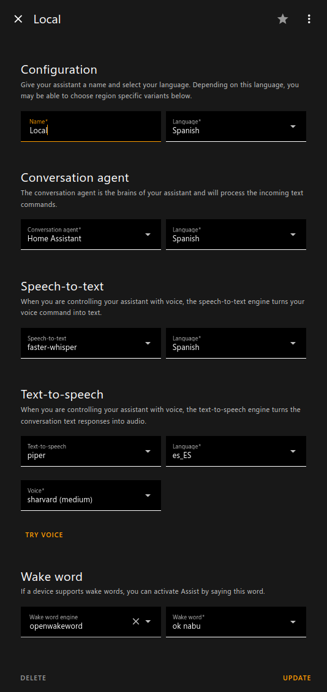

# Local voice assistant setup guide

## Pipeline install

### For HASSOS and HAOS VMs

As you have the addons platform available, simply follow the [official instructions](https://www.home-assistant.io/voice_control/voice_remote_local_assistant/).

### On a Home-Assistant Core instance

You will need to install the Wyoming stack on a docker server previously by using the sample docker-compose file as a reference.

## Assistant configuration

- Setup your assistant

### Related links

https://github.com/rhasspy/wyoming?tab=readme-ov-file

https://github.com/rhasspy/wyoming-piper/blob/master/README.md
https://github.com/rhasspy/wyoming-faster-whisper/blob/master/README.md
https://github.com/rhasspy/wyoming-openwakeword/blob/master/README.md

[Piper configuration.](https://github.com/home-assistant/addons/blob/master/piper/DOCS.md#configuration)
[Available models for spanish.](https://huggingface.co/rhasspy/piper-voices/tree/v1.0.0/es/es_ES)

[Enabling a wake word.](https://www.home-assistant.io/voice_control/install_wake_word_add_on/)

[New assistant configuration.](https://www.home-assistant.io/voice_control/voice_remote_local_assistant/)