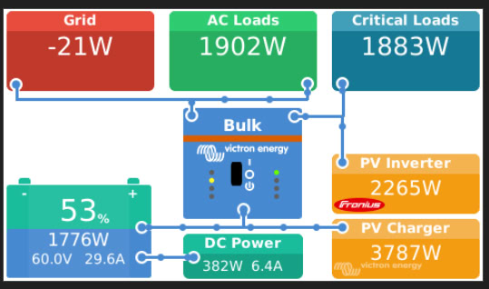

# Mods, tips and tricks for Victron's Venus system

## Bringing back the DC Loads tile to the GUIv1



Recently Victron removed the DC Loads tile allegating that there was not enough space on the screen to show all the tiles when both Ac-in and Ac-out where in use.

By executing the following commands you can bring it back.

Please don't miss the backup part and be aware that depending on the devices present on your installation it may work or not.

All the following commands must be executed on the VenusOs console, so you will need SSH access. Find the procedure at the official documentation.

```bash
cd /opt/victronenergy/gui/qml

# Keeping a backup of the original file
cp OverviewGridParallel.qml OverviewGridParallel.qml.bak

# Download the new file in place
wget https://github.com/SergioRius/recipes-iot/raw/main/Victron_Venus/OverviewGridParallel.qml

# Reboot the device
reboot && exit
```

For recovering the old appearance, simply rename the old file overwriting the new.

```bash
cp OverviewGridParallel.qml.bak OverviewGridParallel.qml

# Reboot the device
reboot && exit
```

Keep in mind that if you do the complete install procedure, you may nuke the backup with a copy of the new file. So if you are trying again or updating this file, don't execute the backup command.

If you update the Venus system, this it will undo this patch and you will have to do it again.

This procedure is shared solely for testing and fun, and never for use in production installations. In case of failure or damage, I decline all responsibility.
